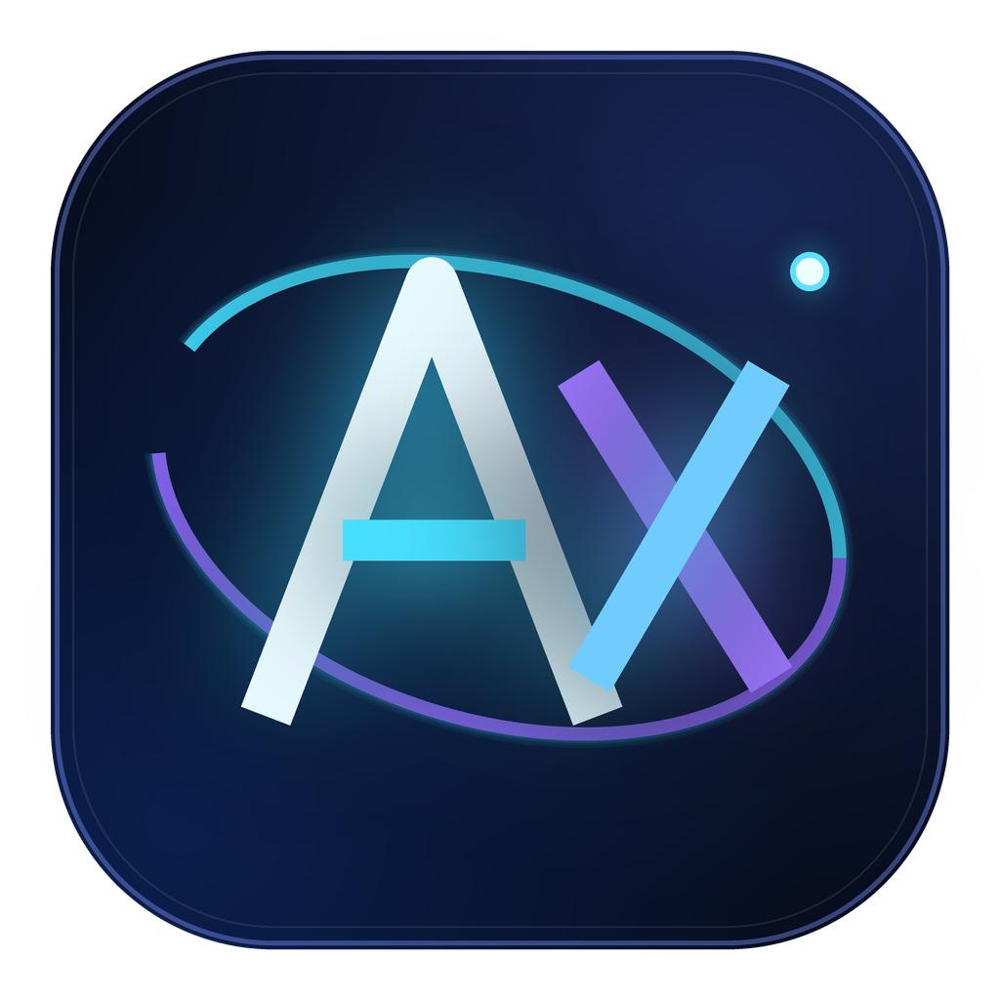
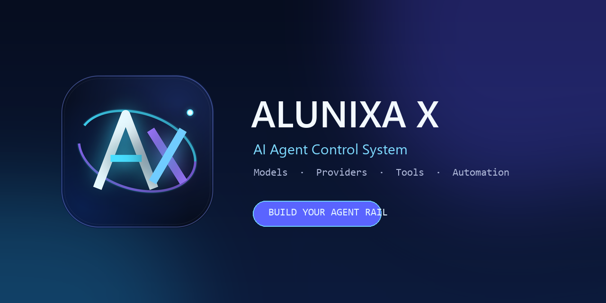
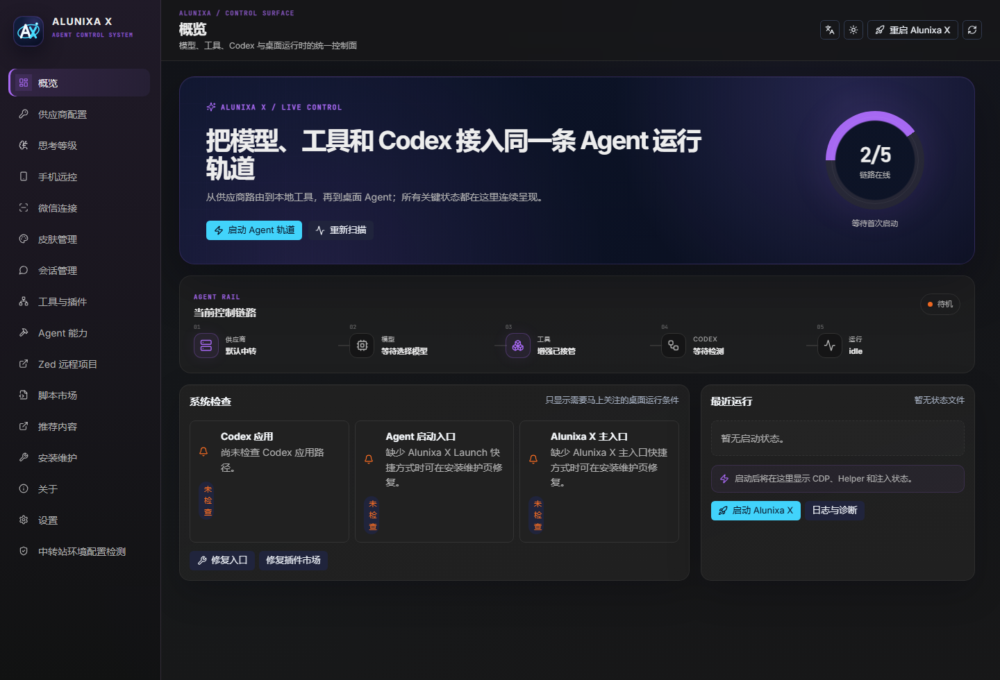

<p align="center">
  
</p>

<h1 align="center">Alunixa X</h1>

<p align="center"><strong>AI Agent Control System</strong></p>

<p align="center">Connect models, providers, tools, automation, integrations, and the Codex desktop runtime on one control rail.</p>

<p align="center">
  <a href="README.md">中文</a> · English
</p>

<p align="center">
  
  
  
  
  
</p>

<p align="center">
  
</p>

## What is Alunixa X

Alunixa X is a cross-platform control system for desktop AI agents. The current release focuses on OpenAI Codex / ChatGPT Desktop and adds a unified external launcher, CDP bridge, local helper, protocol proxy, and management interface without replacing the official renderer or patching `app.asar`.

<p align="center">
  
</p>

```text
Provider → Model → Context → MCP / Skills / Plugins → Codex → Desktop runtime
```

## Highlights

| Surface | Capabilities |
| --- | --- |
| Agent Rail | Continuous provider, model, tool, Codex, and runtime status on the overview screen |
| Provider network | Official, mixed API, pure API, aggregate rotation, per-model routing, Provider Doctor |
| Model catalog | Per-model context windows, auto-compaction token limits, reasoning levels, image handling |
| Full endpoint proxy | `/v1/**` HTTP, SSE, binary, multipart, large bodies, and Realtime WebSocket |
| Image tool | Standalone `image_gen` MCP for generation, edits, multiple inputs, masks, and local outputs |
| Agent capabilities | Shared terminal, session operations, export, project move, Stepwise, memory, Goals, and scripts |
| Connections | Remote Control, personal WeChat, Zed Remote, and existing-session recovery |
| Extensions | MCP, Skills, Plugins, script marketplace, and DreamSkin themes |
| Operations | Startup injection, fail-closed validation, Watcher, diagnostics, updates, and installers |

## Install

Download a platform build from [GitHub Releases](https://github.com/Alunixa-Code/Alunixa-X/releases/latest):

- Windows: `Alunixa-X-*-windows-x64-setup.exe`
- macOS Intel: `Alunixa-X-*-macos-x64.dmg`
- macOS Apple Silicon: `Alunixa-X-*-macos-arm64.dmg`

The installer creates two entries:

- **Alunixa X** opens the main control system.
- **Alunixa X Launch** starts Codex Desktop with the saved provider and agent configuration.

## Privacy

Configuration, credentials, session indexes, and diagnostics are local by default. Future recommendations, anonymous usage metrics, and online catalogs will ship with visible controls and documentation. They are not intended to collect prompts, conversations, file contents, API keys, or terminal output.

## Development

```powershell
cd apps/alunixa-x-manager
npm ci
npm test
npm run check
npm run vite:build

cd ../..
cargo fmt --all -- --check
cargo test --workspace -- --test-threads=1
cargo build --release
```

## Project

- Repository: https://github.com/Alunixa-Code/Alunixa-X
- Issues: https://github.com/Alunixa-Code/Alunixa-X/issues
- Discussions: https://github.com/Alunixa-Code/Alunixa-X/discussions

<p align="center">
  
  
</p>

## License and compatibility

Alunixa X is distributed under the [GNU Affero General Public License v3.0](LICENSE), SPDX `AGPL-3.0-only`. It contains code evolved from CodexPlusPlus and its contributor history; the original copyright and license notices remain in effect. New Alunixa X work is maintained by Alunixa-Code.

Alunixa X is an independent third-party project. It is not affiliated with OpenAI and does not grant rights to OpenAI, ChatGPT, Codex, or other third-party trademarks or assets.
