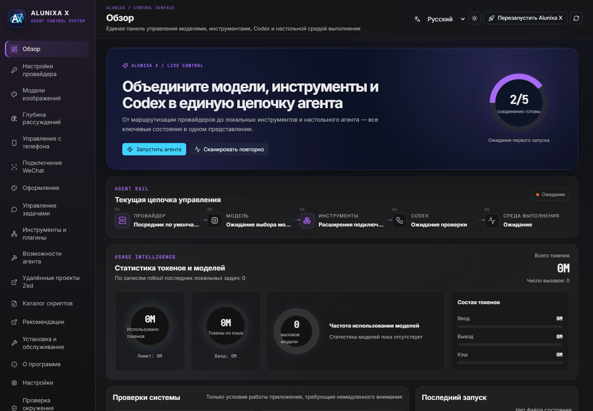

<p align="center">
  
</p>

<h1 align="center">Alunixa X</h1>

<p align="center"><strong>Система управления настольными ИИ-агентами</strong></p>

<p align="center">Модели, провайдеры, инструменты, автоматизация и среда выполнения Codex — в одном приложении.</p>

<p align="center">
  <a href="README.md">中文</a> · <a href="README_EN.md">English</a> · Русский
</p>

<p align="center">
  
  
  
  
  
</p>

## Что такое Alunixa X

**Alunixa X** — менеджер и внешний лаунчер для настольного Codex с поддержкой Windows и macOS. Он объединяет настройку моделей и провайдеров, инструменты MCP, работу с локальными задачами, оформление, диагностику и подключения.

Приложение использует внешний лаунчер, мост CDP, локальный Helper и прокси протоколов. Оно не заменяет официальный рендерер и не переписывает `app.asar` ради установки расширений.

```text
Провайдер → Модель → Контекст → MCP / Skills / Plugins → Codex → Среда выполнения
```

<p align="center">
  
</p>

Alunixa X не является самостоятельной моделью, поставщиком API или заменой установленного Codex. Аккаунты, подписки, ключи API, доступность моделей и ограничения внешних сервисов определяются соответствующими провайдерами.

## Содержание

- [Возможности](#возможности)
- [Платформы и установка](#платформы-и-установка)
- [Русский интерфейс](#русский-интерфейс)
- [Первый запуск](#первый-запуск)
- [Провайдеры, маршруты и протоколы](#провайдеры-маршруты-и-протоколы)
- [Модели и контекст](#модели-и-контекст)
- [Генерация изображений через MCP](#генерация-изображений-через-mcp)
- [Живые обои и Wallpaper Engine](#живые-обои-и-wallpaper-engine)
- [Задачи, инструменты и подключения](#задачи-инструменты-и-подключения)
- [Обновление и восстановление](#обновление-и-восстановление)
- [Данные и конфиденциальность](#данные-и-конфиденциальность)
- [Частые вопросы](#частые-вопросы)
- [Разработка и проверка](#разработка-и-проверка)

## Возможности

| Раздел | Назначение |
| --- | --- |
| Обзор | Состояние цепочки провайдер → модель → инструменты → Codex → среда выполнения, статистика локальных токенов |
| Провайдеры | Официальный вход, смешанный API, режим только API, шаблоны, импорт cc-switch, диагностика |
| Маршрутизация | Отдельные маршруты моделей, ротация запросов, закрепление диалогов, веса и резервирование |
| Модели | Каталог, стартовая модель, контекстное окно, порог автосжатия, глубина рассуждений, обработка изображений |
| Изображения | Независимый `image_gen` MCP, несколько профилей API/Key/Model, генерация и редактирование |
| Оформление | DreamSkin, локальные и ZIP-темы, изображения, видеообои и GIF/APNG |
| Задачи | Просмотр, Markdown-экспорт, удаление с резервированием, перенос между проектами и исправление истории |
| Инструменты | Независимые MCP, Skills, Plugins, каталог и пользовательские скрипты |
| Возможности агента | Общий терминал, исправление вставки, восстановление прокрутки, Stepwise, память, Goals и Fast |
| Подключения | Официальное управление с телефона, личный WeChat, SSH-проекты Zed Remote |
| Обслуживание | Ярлыки запуска, Watcher, диагностика окружения, журналы и обновления GitHub Releases |

## Платформы и установка

Скачайте подходящий пакет из [GitHub Releases](https://github.com/Alunixa-Code/Alunixa-X/releases/latest).

| Система | Установочный пакет | Архив для ручного размещения |
| --- | --- | --- |
| Windows x64 | `Alunixa-X-<версия>-windows-x64-setup.exe` | `Alunixa-X-<версия>-windows-x64.zip` |
| macOS Intel | `Alunixa-X-<версия>-macos-x64.dmg` | `Alunixa-X-<версия>-macos-x64.zip` |
| macOS Apple Silicon | `Alunixa-X-<версия>-macos-arm64.dmg` | `Alunixa-X-<версия>-macos-arm64.zip` |

Официальный установочный пакет для Linux сейчас не выпускается.

### Что нужно заранее

- Установленный и работоспособный Codex Desktop: Alunixa X не включает его дистрибутив.
- Для Windows — среда WebView2, используемая менеджером Tauri.
- Для запросов к моделям — официальный аккаунт или доступный API с вашим ключом и поддерживаемыми моделями.
- Wallpaper Engine не требуется; нативная поддержка Scene/Web удалена в v1.0.24.

### Как установить

**Windows:** запустите `setup.exe` и следуйте мастеру. В меню «Пуск» доступны **AX - Alunixa X** и **AX Launch - Alunixa X**; их можно найти по запросу `AX`. Стандартные страницы установщика также содержат русский языковой ресурс.

**macOS:** откройте DMG и перенесите оба приложения в «Программы»: **Alunixa X (AX)** и **Alunixa X Launch (AX)**. Выбирайте архитектуру своего Mac; старые имена приложений без `(AX)` остаются совместимыми.

**ZIP:** распакуйте архив целиком и сохраните соседнее расположение исполняемых файлов менеджера, лаунчера и MCP-компаньона генерации изображений. Это вариант для ручного размещения, а не автоматическая установка ярлыков.

Два основных входа выполняют разные задачи:

- **Alunixa X** открывает менеджер настроек, диагностики и обновления.
- **Alunixa X Launch** запускает Codex с сохранённой конфигурацией и расширениями.

## Русский интерфейс

В **v1.0.23** добавлен русский язык. В правом верхнем углу выберите **Русский** из списка **简体中文 / English / Русский**.

Переведены страницы менеджера, навигация, настройки провайдеров и моделей, живые обои, диалоги, известные сообщения серверной части и пункты трея «Показать окно»/«Выход». Даты форматируются с локалью `ru-RU`; шрифты с кириллицей входят в сборку.

- Выбор сохраняется локально и восстанавливается после открытия менеджера.
- Смена языка требует подтверждения и перезагружает страницу менеджера. Сначала сохраните редактируемые данные.
- Отмена оставляет текущий язык. Если локальное хранилище недоступно, менеджер не перезагружается.
- При первом запуске язык по умолчанию остаётся китайским; существующие китайские и английские настройки сохраняют своё значение.

**Язык Alunixa X и язык официального Codex — разные настройки.** Выбор русского не заменяет языковой пакет Codex, не записывает `config.toml` и не переключает функцию «Принудительно китайский интерфейс». Имена моделей, пользовательские данные, сторонние темы и исходные сообщения API не переводятся онлайн.

## Первый запуск

1. Откройте **Alunixa X** и выберите удобный язык.
2. На странице **Обзор** проверьте приложение Codex и ярлыки запуска. Если путь не найден либо установлено несколько копий, выберите `Codex.exe`, `Codex.app` или папку приложения и сохраните путь.
3. В **Настройках провайдера** выберите режим входа. Для API укажите базовый URL, ключ, протокол и реальные имена моделей.
4. Загрузите список моделей с сервера или введите его вручную. Выберите **стартовую модель**; при необходимости настройте окно контекста и автосжатие.
5. Включите необходимые расширения. Для применения провайдера также включите отдельный общий переключатель настроек провайдеров.
6. Сохраните конфигурацию. Выполните проверку модели или диагностику провайдера: проверяются настройки, список моделей и один реальный запрос.
7. Запустите Codex кнопкой **Запустить агента** либо через **Alunixa X Launch**.

Сохранённые настройки, для которых указан следующий запуск, не применяются к уже работающему окну автоматически. При первом включении функции, требующей локального прокси, интерфейс отдельно подтверждает перезапуск Codex. Смена языка менеджера такого перезапуска не вызывает.

## Провайдеры, маршруты и протоколы

### Режимы доступа

| Режим | Для чего | Что происходит |
| --- | --- | --- |
| Официальный вход | Работа через аккаунт ChatGPT | Сохраняется официальная авторизация без отдельного ключа режима только API |
| Официальный смешанный API | Аккаунт и выбранный API одновременно | Сохраняется официальный вход, API-запросы используют настроенного провайдера |
| Только API | Сторонний или собственный сервер моделей | Записываются управляемые `config.toml` / `auth.json` и каталог моделей |

Профили можно добавлять, редактировать, сортировать перетаскиванием, проверять и импортировать из cc-switch. Предпросмотр показывает конфигурацию перед переключением. **Выключенный общий переключатель провайдеров позволяет сохранить изменения, но не применяет их к рабочим файлам Codex.**

Проверка окружения помогает найти переменные, файл Codex `.env` и состояние Clash Verge Rev TUN, которые могут мешать подключению. Удаление переменных выполняется только после подтверждения; `CODEX_HOME` автоматически не удаляется.

### Маршрутизация и агрегаторы

- **Маршрут модели** точно сопоставляет имя модели с целевым провайдером и использует его URL/ключ. Цель должна поддерживать Responses API; маршрут на самого себя или агрегатор не допускается.
- **Агрегатор** ссылается на существующих API-провайдеров, не копируя их ключи.
- **Ротация по запросам** меняет участника для каждого запроса.
- **Ротация по диалогам** по возможности сохраняет одного участника для одной задачи.
- **Взвешенная ротация** распределяет запросы по заданным весам.
- **Резервирование при сбое** предпочитает первого доступного участника в заданном порядке.

Стратегия не делает возможности разных моделей одинаковыми: учитывайте поддержку инструментов, изображений, контекст и протокол каждого участника.

### Прокси и границы совместимости

Локальный прокси работает с Responses, Chat Completions, устаревшим Completions, Anthropic и Gemini. Передача в рамках одного протокола охватывает соответствующие HTTP/SSE-запросы, двоичные данные, multipart и Realtime WebSocket.

Межпротокольное преобразование не обещает поддержку любых закрытых расширений. Непредставимые инструменты, частные поля, несовместимая подписанная история и оборванные потоки приводят к явной ошибке, а не к молчаливому удалению данных. Запросы с неизвестным результатом не повторяются вслепую.

Подробная матрица и формат восстановления истории описаны в [документе о точности протоколов](docs/protocol-fidelity.md).

## Модели и контекст

**Стартовая модель** определяет контекстное окно и порог сжатия в корневом `config.toml`. Настройка другой модели сохраняется в каталоге и сама по себе не меняет стартовую модель.

- Контекстное окно задаётся отдельно для каждой модели.
- Порог автосжатия — положительное целое число, не превышающее окно контекста.
- При отключении автосжатия управляемый порог не записывается.
- Глубина рассуждений настраивается по провайдеру и модели; фактическая поддержка зависит от API.
- Для изображений доступны передача без изменений, удаление для текстовой модели или предварительный анализ отдельной VLM.
- Для VLM необходимы отдельные базовый URL, ключ и модель.

Графики токенов и частоты моделей рассчитываются по локальным файлам задач rollout. Это не счёт от провайдера и не полная статистика всех облачных задач.

## Генерация изображений через MCP

Откройте **Модели изображений** и добавьте профиль из трёх основных полей:

| Поле | Содержимое |
| --- | --- |
| Адрес API | Базовый адрес сервиса, совместимого с OpenAI Images; также принимаются соответствующие адреса генерации/редактирования |
| Ключ API | Ключ выбранного сервиса |
| Model | Реальный идентификатор модели на этом сервисе |

Можно сохранить несколько профилей. Перетащите нужный профиль на первое место — он будет отмечен **По умолчанию**, порядок сохраняется автоматически. Доступны также кнопки вверх/вниз и сортировка с клавиатуры: Пробел, стрелки, Пробел; Escape отменяет действие.

Генерация и редактирование используют API, ключ и модель выбранного профиля, не переключая провайдера основного диалога. При редактировании оставьте поле ключа пустым, чтобы сохранить существующее значение. Конфликт изменений между окнами отклоняется, а не перезаписывает более новые настройки.

Для первого использования включите расширения и запустите Codex через Alunixa X: так загружается MCP `image_gen`. Уже загруженный новый MCP перечитывает конфигурацию при каждом вызове, поэтому последующие сохранения и сортировка не требуют перезапуска.

Если `model` и `profile_id` не указаны явно, выбирается первый профиль. Удаление всех профилей возвращает исходного провайдера и прежнюю модель изображений по умолчанию. Автоматической ротации или повторной отправки через другой профиль изображений нет.

Результаты сохраняются локально в `generated_images` выбранного Codex home. Обычный список профилей и диагностические ответы не показывают ключи; полная резервная копия конфигурации при этом содержит секреты.

## Живые обои и Wallpaper Engine

Используйте **v1.0.24 или новее**. В v1.0.22/v1.0.23 основной лаунчер не подключал маршруты медиа и возвращал `Unknown bridge path`, хотя отдельный тест проходил. Теперь оба лаунчера и проверка воспроизведения используют одну точку подключения моста.

**Нативная поддержка Scene/Web Wallpaper Engine удалена.** Проверка скрытого за пределами мониторов окна дала чёрные кадры. В соответствии с приоритетом стабильности эта экспериментальная схема не выпускается: программа не запускает движок или отдельное окно, не захватывает рабочий стол и не выполняет скрипты проекта. Русский интерфейс и остальные функции сохранены.

Если нужен только первоначальный фон из изображения, импортируйте PNG/JPEG или другую статичную картинку. GIF/APNG и видео остаются необязательными возможностями; Wallpaper Engine больше не нужен.

### Как настроить

1. Откройте **Оформление → Живые обои**; те же элементы есть в настройках.
2. Нажмите **Импортировать файл обоев** и выберите изображение, анимацию или видео.
3. Включите обои, задайте непрозрачность и масштабирование; для видео доступны звук и пауза.
4. Сохраните настройки и при удобном случае запустите Codex через новый Alunixa X.

Предпросмотр всегда без звука. Сохранение не перезапускает текущую задачу. **Сбросить фон** сбрасывает только обои, а не провайдеров, задачи или DreamSkin. Выбор папки проекта и исполняемого файла движка удалён.

| Формат | Windows | macOS | Поведение |
| --- | --- | --- | --- |
| PNG/JPEG/BMP/статичный WebP | Да | Да | Исходное изображение и режимы масштабирования |
| GIF/APNG/анимированный WebP | Да | Да | Сохранение исходных кадров |
| MP4/M4V/WebM/MOV/OGV | Да | Да | До 2 GiB; зависит от кодека, предпочтительно H.264 MP4 или WebM |
| Старые настройки Wallpaper Engine Video | Только видео | Только видео | Чтение файла без запуска движка |
| Старые настройки Scene/Web | Только превью | Только превью | Явная метка статичного превью, не воспроизведение сцены |
| Wallpaper Engine Application | Не запускается | Не запускается | Выполнение программ не поддерживается |

Для старых Scene/Web читается только изображение `preview` внутри проекта. Если поле не задано, проверяются обычные имена `preview.jpg/png/jpeg/webp`. Интерфейс прямо сообщает, что сцена не запускается. При отсутствии картинки, выходе пути за пределы проекта или выборе скрипта вместо изображения загрузка отклоняется; импортируйте другую картинку или видео.

Исходный `project.json` и ресурсы не изменяются. Старый путь к движку хранится только для совместимости настроек и никогда не запускается. Импортированные медиа копируются без перекодирования в папку `wallpapers`; большие файлы передаются через ограниченный дисковый File/Blob без ослабления CSP. Подробности — в [руководстве по обоям](docs/wallpapers.md).

## Задачи, инструменты и подключения

### Локальные задачи и восстановление

Менеджер читает локальную базу SQLite и файлы rollout: позволяет просматривать задачи, экспортировать Markdown, переносить проекты, исправлять привязку провайдера и удалять выбранные задачи. Удаление подтверждается и сопровождается предусмотренной функцией резервной копией; занятые файлы могут быть пропущены.

Очистка изображений выносит только старые Base64-копии, уже заменённые последующими контрольными точками сжатия. Текущий контекст восстановления и задачи с записями отката защищены. Для обработки обычных активных задач может потребоваться полностью закрыть Codex; при работающем приложении проверяется ограниченная область архивов.

Записи без источника в `session_index.jsonl` не обязательно являются мусором: это могут быть облачные или ещё не сохранённые задачи. Проверяйте предлагаемые записи перед очисткой.

### Инструменты и возможности агента

MCP, Skills и Plugins управляются отдельно от провайдеров и объединяются при переключении. Сторонние инструменты всё равно требуют собственных зависимостей, прав и ключей.

Общий терминал позволяет видеть выполнение команд ИИ и при необходимости вручную вводить пароль или подтверждение. Дополнительные переключатели управляют вставкой текста, прокруткой, меню задач, Fast, Goals, производительностью и запуском; требования к перезапуску указаны рядом с ними.

Stepwise получает предложения следующих шагов через отдельно настроенный API. Поиск памяти использует настроенную модель эмбеддингов либо локальный BM25, если эмбеддинги отключены или недоступны.

### Подключения

- **Управление с телефона:** официальный вход в ChatGPT, состояние Remote Control, создание временного кода сопряжения и отзыв доступа устройств. Доступность зависит от официального сервиса, аккаунта и клиентских возможностей.
- **WeChat:** вход по QR-коду, выбранная рабочая папка и CLI, отдельная задача Codex для каждого контакта, прогресс команд и инструментов. Настройте разрешённые контакты и доступ к песочнице.
- **Zed Remote:** SSH-проекты, история и открытие файлов по `ssh://`. Требуются рабочая SSH-среда и поддержка Zed Remote; наличие записи не создаёт подключение само по себе.
- **DreamSkin:** локальные темы, ZIP-пакеты и сообщество. Пакет оформления и обычный слой живых обоев — разные функции.

## Обновление и восстановление

Проверяйте обновления на странице **О программе** или скачивайте пакет нужной архитектуры из GitHub Releases. Обновление запускает установщик; это не означает, что уже работающий Codex получил новые расширения.

Перед переносом на другой компьютер или существенной сменой конфигурации экспортируйте полную резервную копию. **Она содержит ключи API, данные входа и пользовательские скрипты.** Храните её как конфиденциальный файл.

Для восстановления используйте импорт полной конфигурации или специальную функцию восстановления соответствующего раздела. Для отката программы доступен предыдущий пакет в истории Releases; сохраните резервную копию настроек. Не удаляйте базу задач ради исправления языка или обоев.

Каждый официальный выпуск строится из одного неизменяемого тега GitHub Actions для Windows x64, macOS Intel и Apple Silicon. Публикуются шесть установочных/ZIP-файлов; описание выпуска содержит изменения, исходный commit, запуск CI и SHA-256.

### Переход с Codex+++

Alunixa X продолжает использовать `~/.codex-session-delete/settings.json`, поэтому существующие провайдеры, модели и настройки расширений не требуют ручного копирования. Старое приложение не удаляется принудительно: сначала проверьте Alunixa X, затем удаляйте прежнюю версию при необходимости.

Сведения о старой ветке и переходном выпуске находятся в [Codex+++ v1.2.67](https://github.com/Alunixa-Code/CodexPlusPlusPlus/releases/tag/v1.2.67). Для новой установки используйте актуальный выпуск Alunixa X.

## Данные и конфиденциальность

| Данные | Расположение по умолчанию |
| --- | --- |
| Настройки Codex | `~/.codex/config.toml` |
| Авторизация Codex | `~/.codex/auth.json` |
| Настройки менеджера | `~/.codex-session-delete/settings.json` |
| Импортированные обои | `~/.codex-session-delete/wallpapers/` |
| Сгенерированные изображения | `$CODEX_HOME/generated_images/` |
| Копии перед исправлением guardian | `<Codex home>/alunixa-x-config-repair-backups/` |
| Копии синхронизации провайдера | `<Codex home>/backups_state/provider-sync/` |
| Язык интерфейса | Локальное хранилище WebView менеджера |

Если задан `CODEX_HOME`, связанные с Codex пути используют выбранную папку; собственная папка состояния менеджера остаётся отдельной. На Windows `~` означает домашнюю папку пользователя.

Локальная обработка не означает полностью автономную работу: запросы к моделям отправляются вашим провайдерам, обновления и каталоги используют сеть, WeChat и Remote Control обращаются к своим сервисам.

Не прикладывайте полный `auth.json`, ключи API, резервные копии с секретами или содержимое частных задач к публичным отчётам.

## Частые вопросы

### Почему после выбора русского Codex остался на прежнем языке?

Русский перевод относится к менеджеру Alunixa X. Язык нативного Codex и переключатель принудительного китайского интерфейса независимы.

### Почему сохранённый провайдер не применяется?

Проверьте общий переключатель провайдеров, активный профиль и успешное сохранение. Запускайте через Alunixa X Launch. Переменные окружения и `.env` могут перекрывать настройки.

### Видео видно в предпросмотре, но не в Codex

Установите v1.0.24 или новее, включите обои, задайте ненулевую непрозрачность, сохраните и запустите Codex через новый лаунчер. `Unknown bridge path` в v1.0.22/v1.0.23 означает ошибку подключения интерфейса в лаунчере, а не неверно выбранную папку. Предпросмотр менеджера и реальное воспроизведение в Codex — разные этапы; изучите диагностику в разделе «О программе».

### Выбрана папка Wallpaper Engine, но сцена не появилась

Нативная поддержка Scene/Web удалена в v1.0.24. Для старой настройки используется только доступное изображение-превью с явной меткой; при его отсутствии импортируйте изображение или видео. Движок не запускается.

### Новые и старые задачи сообщают `FeatureToml` / `features.guardianv2`

На панели живых обоев нажмите **Исправить конфигурацию задач**, затем заново откройте проблемную задачу. Перед изменением сохраняется исходный TOML; исправляется конкретная некорректная конфигурация guardianv2 с сохранением других настроек. Это не универсальное исправление синтаксиса TOML, проектных конфигураций или всех возможных причин ошибки.

### Генерация использует другую модель изображений

Проверьте первый профиль и явные параметры `model` / `profile_id`. При первом использовании MCP должен быть загружен через Alunixa X. Последующие сохранения и перестановки перечитываются при следующем вызове.

### Как сообщить об ошибке

Укажите версии Alunixa X и Codex, ОС и архитектуру, последовательность действий, ожидаемый/фактический результат и обезличенный диагностический отчёт. Для обоев добавьте формат, кодек или тип проекта. Публикуйте отчёт в [Issues](https://github.com/Alunixa-Code/Alunixa-X/issues).

## Разработка и проверка

Стек: Rust edition 2024, Tauri 2, React 19, TypeScript 5 и Vite 6. Официальный CI использует Node.js 22; версии зависимостей фиксируются lock-файлами.

Подготовьте Node.js/npm, Rust stable и [зависимости Tauri для своей платформы](https://v2.tauri.app/start/prerequisites/): MSVC/WebView2 для Windows, Xcode Command Line Tools для macOS. Установщик Windows собирается NSIS, macOS-пакеты — на macOS. WSL в процессе проекта не используется.

Из корня репозитория:

```powershell
npm --prefix apps/alunixa-x-manager ci
npm --prefix apps/alunixa-x-manager test
npm --prefix apps/alunixa-x-manager run check
npm --prefix apps/alunixa-x-manager run vite:build
node tools/i18n-verify.mjs
node tools/check-local-branding.mjs
cargo fmt --all -- --check
cargo test --workspace --locked --no-fail-fast -- --test-threads=1
cargo check --workspace --all-targets --locked
cargo build --release --locked
```

Запуск менеджера для разработки:

```powershell
npm --prefix apps/alunixa-x-manager run dev
```

Один Vite предоставляет только интерфейс, а не нативные команды Tauri. Для теста в браузере нужен изолированный fixture команд.

```text
apps/alunixa-x-manager/     Tauri и React: интерфейс менеджера
apps/alunixa-x-launcher/    Лаунчер и MCP-компаньон изображений
crates/alunixa-x-core/      Конфигурация, запуск, CDP, прокси, установки
crates/alunixa-x-data/      Задачи, хранение, экспорт и синхронизация
assets/inject/             Скрипты расширения интерфейса Codex
scripts/installer/         NSIS и macOS DMG
tools/                     Проверки локализации и изолированные UI-тесты
docs/releases/             Подробные описания выпусков
```

### Поддержка перевода

В менеджере исходные китайские строки служат ключами `t()` и `tf()`. Английский каталог — `src/i18n-en.ts`, русский — `src/i18n-ru.ts`, выбор языка — `src/i18n.ts`.

При добавлении текста обновляйте оба каталога. `node tools/i18n-verify.mjs` проверяет реальные вызовы во всех production TS/TSX-файлах, отсутствие пропущенных и лишних ключей, параметры `{0}`/`{1}` и группы `$1` в сообщениях серверной части. Перевод не требует сетевого сервиса во время работы.

После сборки интерфейса, с установленными Python Playwright и Chromium:

```powershell
python tools/verify-russian-ui.py
```

Тест открывает production-интерфейс в отдельном Chromium, проверяет страницы, подтверждение/отмену смены языка, сохранение после перезагрузки, параметры команд трея, светлую/тёмную темы и узкие окна. Реальный аккаунт, конфигурация и работающий Codex не используются. Воспроизведение медиа и переход старых настроек к превью проверяются отдельно через Electron, без запуска Wallpaper Engine; тест перевода не заменяет этот контроль.

## Проект и лицензия

- [Репозиторий](https://github.com/Alunixa-Code/Alunixa-X)
- [Выпуски и файлы установки](https://github.com/Alunixa-Code/Alunixa-X/releases)
- [Сообщения об ошибках](https://github.com/Alunixa-Code/Alunixa-X/issues)
- [Обсуждения](https://github.com/Alunixa-Code/Alunixa-X/discussions)
- [История изменений](CHANGELOG.md)

Лицензия — [GNU Affero General Public License v3.0](LICENSE), SPDX `AGPL-3.0-only`. Проект содержит код, развивавшийся из CodexPlusPlus; исходные сведения об авторстве и лицензировании сохраняются. Новые изменения Alunixa X поддерживает Alunixa-Code.

Alunixa X — независимый сторонний проект, не связанный с OpenAI. Права на марки и ресурсы OpenAI, ChatGPT, Codex и других компаний не передаются вместе с этим проектом. Обновления Codex могут менять интерфейс, CDP и формат локальных данных, поэтому отдельным интеграциям может потребоваться адаптация.
